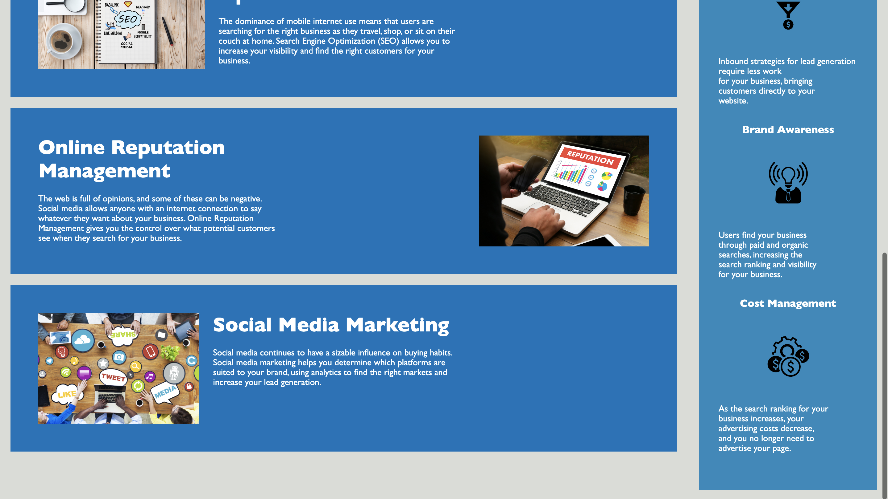

# Homework 1

## Title
An accessible digital marketing website for a marketing agency.

## Description 

What? A project that launches a digital marketing website for a marketing agency.
Why? To help the agency advertise its services.
How? By ensuring that the website follows accessbility standards and is optimized for search engines.

## Link to Deployed Application

HTML file: Develop/index.html

## Usage 

Run the HTML file ensuring that it opens in a web browser (Preferably: Google Chrome or Safari)
The HTML file will automatically access the CSS file as they have been linked.

## Credits

Changes were made to code provided by Bryan Wu.

© 2020 Trilogy Education Services, LLC, a 2U, Inc. brand. Confidential and Proprietary. All Rights Reserved.
